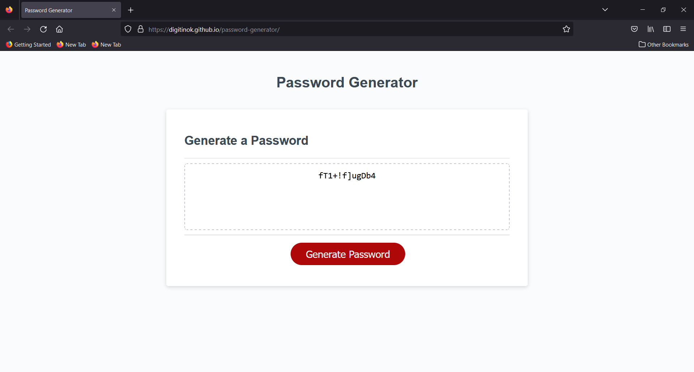

# Password Generator

## Description

This project will generate a random password of user specified length using characters (lower  case letters, upper case letters, numbers and / or special characters) specified by the user via prompts.

### Repository

https://github.com/digitinok/password-generator

### Deployed Page

https://digitinok.github.io/password-generator/

## Installation

n/a

## Usage

To generate a random password, click the "Generate Password" button on the webpage and answer the following prompts. The randomly generated password will be displayed in the text box.

This is how the deployed page looks like:

Screenshot of deployed Page

## Future Improvements

Use form input elements to collect user password length and character selections rather than prompting the user.

## Credits

N/A

## License

This project uses the MIT License. Please see the license file in the repositiry for fursther details.